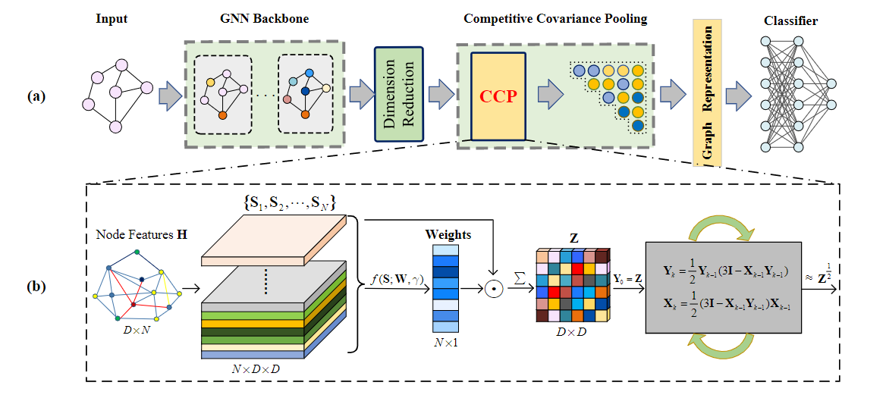

# CCP-GNN: Competitive Covariance Pooling for Improving Graph Neural Networks

# Introduction
Graph neural networks (GNNs) have advanced performance of many graph-related tasks, especially graph classification. For GNNs, a global pooling is usually used to generate final graph representations by summarizing node features, which is critical to graph classification. Most of existing
GNNs are built with a global average pooling or its variants, which however, t**ake no full consideration of node specificity while neglecting rich statistics inherent in node features**, limiting classification performance of GNNs. To address above issues, this paper proposes a novel Competitive Covariance Pooling (CCP) based on observation of graph structure.

**The contributions of our work are concludedas three-fold:**
1. We propose a CCP-GNN architecture for graph classification, whose core is an effective Competitive Covariance Pooling (CCP) embedded in the end of GNNs to produce powerful global graph representations by considering node specificity, feature correlation, and geometry of covariances; 
1. To our best knowledge, our CCP makes the first attempt to explore powerful, node-level second-order representations to learn node weights in a competitive manner, which shows a good ability to discover key nodes; 
1. Extensive experiments are conducted on seven benchmarks using various GNNs show that our CCP outperforms its counterparts while CCP-GNN achieves state-of-the-art performance


# Requirement

```
CUDA-VERSION: 11.3
torch: 1.10.1
torch-geometry: 2.0.1
ogb: 1.3.1
torch-scatter
rdkit
matlibplot
```
# Reproduce
For HIV-dataset:

`python main_ogbg.py --config configs/ogbg-molhiv-ccp-sr1-128-2-32-gin.json`

For PCBA-dataset:

`python main_ogbg.py --config configs/ogbg-molpcba-ccp-sr1-128-64-32-gin.json`


# Citation

```BibTeX
@article{ccpgnn,
  author       = {XXX},
  title        = {CCP-GNN: Competitive Covariance Pooling for Improving Graph Neural Networks},
  journal      = {{IEEE} Trans. Neural Networks Learn. Syst.},
  volume       = {1},
  number       = {1},
  pages        = {1--10},
  year         = {2024},
}
```

